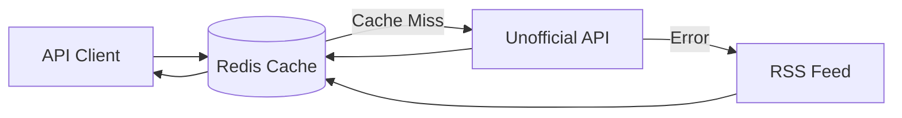

<p align="left">
  
</p>

An unofficial, open-source API for accessing and displaying Substack content in external applications. It combines Substack’s unofficial API and RSS feeds for reliability and performance.

📌 **Official Website:** [substackapi.dev](https://substackapi.dev) – Find the latest guides, documentation, and updates.

[](https://substackapi.dev)


## Features

- Fast and reliable access to publication content
- Simple authentication using API keys
- Redis-powered caching for optimal performance
- Generous rate limits
- Free to use

## Getting Started

### 1. Generate an API Key
Visit [auth.substackapi.dev](https://auth.substackapi.dev) to create your API key. You'll need your Substack publication URL.

### 2. Try the API
You can try out all endpoints and see detailed documentation at [substackapi.dev/endpoints](https://substackapi.dev/api-reference/endpoint/posts-latest).

### 3. Make API Requests
Include your API key in the `X-API-Key` header when making requests:

```bash
curl https://api.substackapi.dev/posts/latest?publication_url=example.substack.com \
-H "X-API-Key: your_api_key_here"
```

### Available Endpoints
- `/posts/latest` - Get the latest posts
- `/posts/top` - Get the most popular posts
- `/posts/search` - Search for posts
- `/post` - Get a single post by slug


## Usage Guidelines

- This API is intended for content owners accessing their own Substack publication data
- Each API key is limited to accessing a single publication
- Rate limits apply per endpoint (see [Usage Limits](https://substackapi.dev/usage-limits))
- Test API key available: `sk_test_9b0j6a1bdbf4f38b1`

## Technical Overview

The API implements a simple hybrid approach combining:
1. Substack's unofficial API (primary data source)
2. RSS Feed (fallback mechanism)
3. Redis caching layer



This architecture ensures:
- Reliable and unlimited access to publication data
- Minimal dependency on unofficial APIs
- Fast response times
- High availability through fallback mechanisms

For more technical details, visit [Technical Overview](https://substackapi.dev/technical-overview).

## Author

Created and maintained by Noah Bjorner
- 📧 Email: bjornernoah@gmail.com
- 🛠 GitHub: @Noah-Bjorner

## License

This project is licensed under the MIT License - see the LICENSE file for details.
